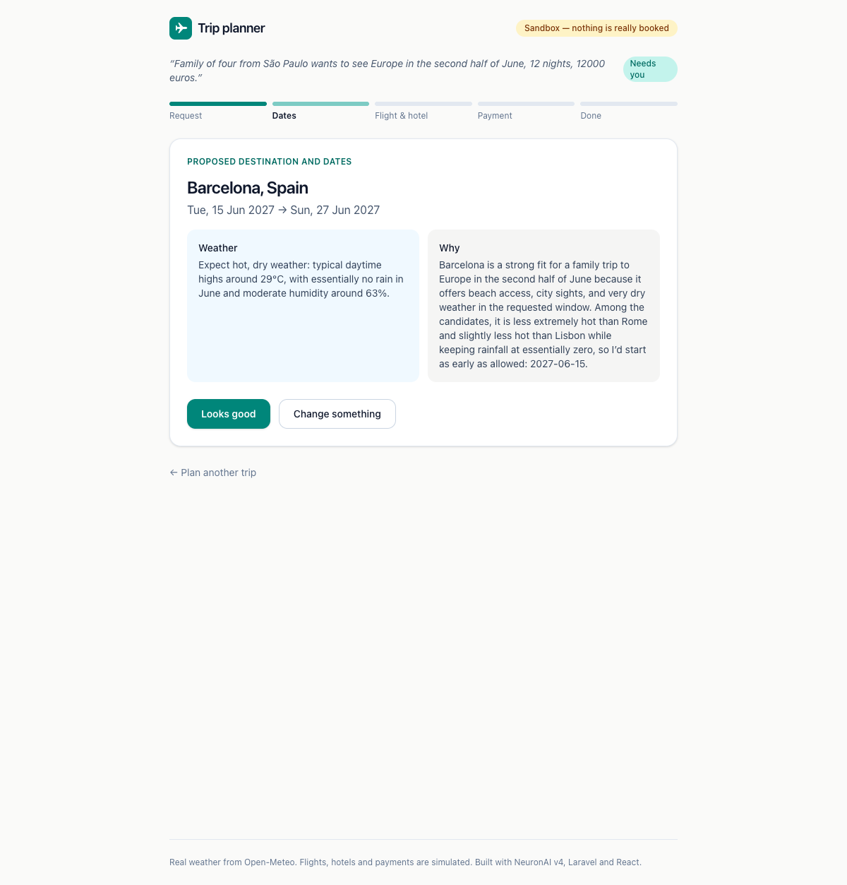

# Neuron Trip Planner

**An agentic AI application in PHP, built with [NeuronAI](https://neuron-ai.dev) v4:**
tell it where you would like to go — "the best time to visit Japan",
"somewhere warm with beaches in February", "Europe in the second half of
June", from any city in the world — and four agents and a durable workflow
choose the place and the dates from real weather data, find the best-value
flight and hotel, and book them. They stop for your decision at every point
that matters, and never spend a cent you did not authorise.



It is the worked capstone of the book *Agentic AI in PHP with NeuronAI*, where
it is built step by step: every design decision below has a chapter section
explaining why.

| | |
|---|---|
| [`core/`](core) | The library: agents, tools, the workflow, the sandbox travel services, a command-line runner and 20 model-free tests. |
| [`web/`](web) | A Laravel 13 API and a React + Tailwind SPA on top of `core/`: queued workflow segments, fenced resumes, expiring payment holds. |

**Geocoding and weather are real** (Open-Meteo, free, no key). **Flights,
hotels and payments are a sandbox** — deterministic, realistic, and nothing is
ever booked or charged.

## What it demonstrates

- **A workflow, not a free-roaming agent.** The graph decides the order —
  where and when, then flight and hotel, then payment, then booking — and the
  agents do the judgement inside each step.
- **Human in the loop, three times.** Each checkpoint is an `interrupt()`; the
  run is persisted and can be answered hours later, from another process.
- **Durable steps and `memoize()`.** A crash or a pause never repeats a model
  call, and never shows the traveller a different proposal from the one they
  approved.
- **Trust boundaries.** The model names cities and chooses offer IDs; the
  application geocodes and prices. Your dates are enforced in code.
- **Money safely.** The payment must repeat the exact amount, expires, and
  books flight and hotel as a saga: idempotency keys, compensation on "sold
  out", recovery without double-booking on a timeout.
- **Testable without a model.** Every path — including crashes, expiry and
  compensation — runs against NeuronAI's `FakeAIProvider`.
- **PHP 8.5** throughout: pipe operator, `clone` with, `#[\NoDiscard]`,
  `array_first()`, the URI extension, closures in constant expressions.

## Quick start

```bash
# command line
cd core && composer install && cp .env.example .env   # set OPENAI_API_KEY
php run/trip.php "Best time to visit Japan? Two of us from Milan, 10 nights, 6000 euros."

# web
cd web && composer install && cp .env.example .env    # set OPENAI_KEY
php artisan key:generate && php artisan migrate
npm install && npm run build && php artisan dev
```

Requires PHP 8.5 and, for the web app, Node 22+. A capable model is needed —
verified with OpenAI `gpt-5.4-mini`; small local models such as `llama3.2`
run but rarely produce usable proposals.

## Checks

```bash
cd core && composer check          # php -l, PHPStan level 8, PHPUnit
cd web && php artisan test && vendor/bin/phpstan analyse && npm run typecheck
```

MIT licensed.
